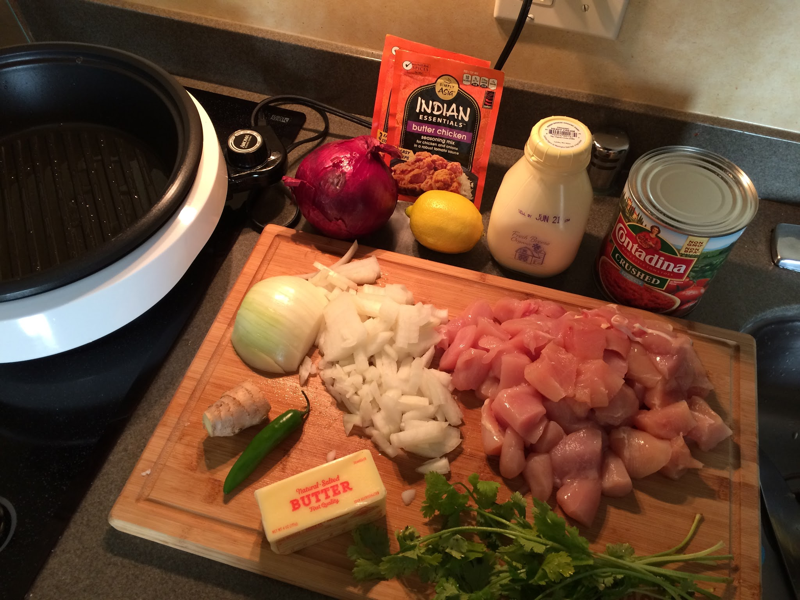

# Indian Butter Chicken

## Ingredients

* 2 Packets of [Simply Asia Indian Essentials Butter Chicken](https://www.amazon.com/Indian-Essentials-Seasoning-Butter-Chicken/dp/B00H5QPCW8) mix
* 1 Serrano pepper
* 1 White Onion
* 2 lb. free range organic chicken
* 2 cups of heavy cream
* 1 small ginger chunk
* 1 28 oz crushed can of tomatoes
* 4 tbsp butter

For the salad:

* 1 Red Onion
* 1 Lemon
* 1 Sprig of Parsley or Cilantro

## Directions

Main Dish

* Chop white onions, ginger and serrano pepper (keep seeds if desire spicy).
* Stir in a hot cooking pot (or Aroma cookware as shown) add oil.  Heat until chicken is translucent.
* Add chicken to pot and stir for about 4 minutes until no longer pink.
* Add crushed tomatoes and Indian spice and cook for about 40 minutes at medium heat.
* Add heavy cream and lower to low heat for 10 minutes.

Salad

* Thinly slice red onions
* Squeeze lemon
* Add herb

Serve chicken with basmati rice and salad on the side.
