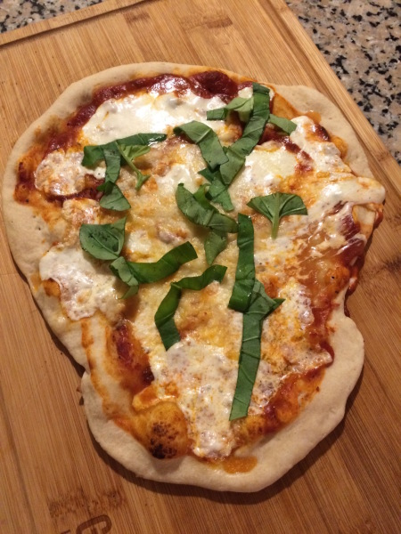

# Neapolitan Pizza

## Ingredients

* 500 grams (4 cups) of flour
* 1 teaspoon of salt
* 7 grams of dry yeast
* 325 mil (1.37 cups) warm water
* Fresh basil
* Fresh mozzarella

## Directions

Mix yeast in warm water and stir slowly; then mixture to flour salt.   Put in a dough machine and knead for 10 minutes.

Stretch dough and top with tomatoes and mozzarella.

Bake in oven for 5 to 7 minutes at highest temperature.  Having a pizza steel plate or pizza stone will help with the heat retention.  Rotate pizza a few times to get heat evenly distributed.

Add basil after pizza is done and ready.
