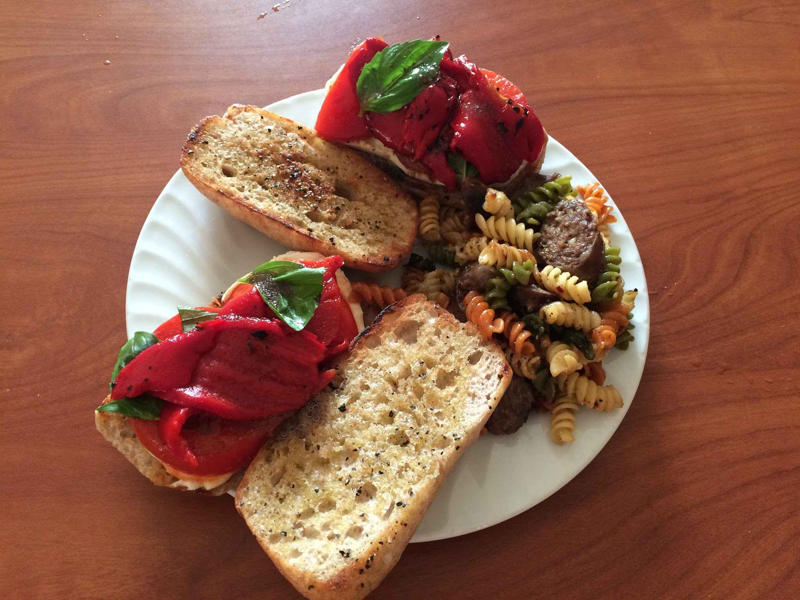

# Veggie Roasted Peppers and Mozzarella

## Ingredients

* Roasted peppers
* Mozzarella cheese
* Cibatta roles
* Olive oil
* Salt & Pepper
* Basil
* Vinaigrette dressing
* Tomatoes

## Directions

* Drizzle cibatta with olive oil, sprinkle bread with salt and peppers.
* Toast on a frying pan for no more than 2 minutes.
* Add mozzarella, roasted peppers, basil, tomato slices.
